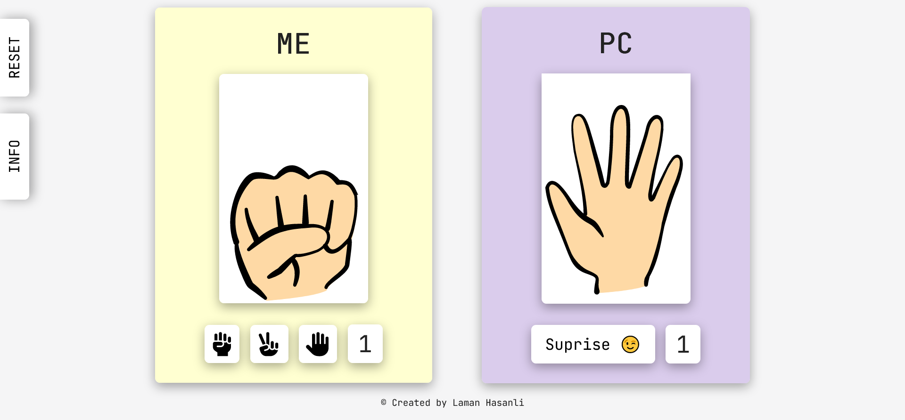

# Rock Paper Scissors game

This is a source code for the traditional rock paper scissors game.

## Table of contents

- [Overview](#overview)
  - [Description](#description)
  - [Screenshot](#screenshot)
  - [Links](#links)
- [My process](#my-process)
  - [Built with](#built-with)
- [Author](#author)

## Overview

### Description

Users should be able to:

- View the optimal layout for the site depending on their device's screen size
- Play against PC which makes random moves
- Win the game if reach the score of 3
- Reset game anytime and start again

### Screenshot

### Links

- Solution URL: [https://github.com/HasanliLaman/rock-paper-scissors](https://github.com/HasanliLaman/rock-paper-scissors)
- Live Site URL: [https://hasanlilaman.github.io/rock-paper-scissors/](https://hasanlilaman.github.io/rock-paper-scissors/)

## My process

### Built with

- Semantic HTML5 markup
- CSS custom properties
- Grid
- Mobile-first workflow
- Javascript

## Author

- Github - [Laman Hasanli](https://github.com/HasanliLaman)
